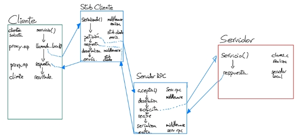

Universidad Carlos III 

Curso Sistemas Distribuidos 2024-25 Ejercicio 3

Curso 2024-25

Sistemas Distribuidos

**Grado Ing Informática**

Fecha: **27/04/2025** - ENTREGA: **III** GRUPO: **80**

Alumnos:

**Hector  Álvarez Marcos** 100495794**

` `**Angela Elena Serrano Casas** 100475053

- [Introducción](#Introducción)
- [Diseño e implementación](#diseño-e-implementación)
    - [Decisiones principales](#decisiones-principales)
    - [Comunicación por medio de middleware de ONC RPC](#comunicación-por-medio-de-middleware-de-onc-rpc)
    - [Diagrama de comunicación](#diagrama-de-comunicación)
        - [Servidor](#servidor)
        - [Cliente](#cliente)
        - [Middleware serializador/deserializador](#middleware-serializadordeserializador)
- [Compilación](#compilación)
- [Pruebas](#pruebas)
    - [Guernika](#guernika)
    - [Clientes Generados](#clientes-generados)
    - [Pruebas de estrés](#pruebas-de-estrés)
        - [test_easy_stress.sh](#test_easy_stresssh)
        - [test_hard_stress.sh](#test_hard_stresssh)
        - [test_pesao.sh](#test_pesaosh)
- [Conclusión](#conclusión)

# **Introducción**
En este tercer ejercicio evaluable, se nos solicitaba realizar la implementación que se realizó tanto como en el primer como en el segundo ejercicio evaluable, que era realizar la transformación de un sistema monolítico a uno distribuido, siguiendo una estructura cliente-servidor, en la cual se otorga al cliente una API de funciones relacionadas con la inserción, almacenamiento y verificación de distintos valores en un sistema.

En este ejercicio en particular, se solicitaba que se realizara la comunicación mediante el uso de ONC RPC.

Los ONC RPC, de sus siglas en ingles Open Network Computing Remote Procedure Calls, es decir, llamadas a procedimientos remotos. Básicamente, los RPC requieren de un archivo de extensión .x, el cuál almacena la información requerida sobre qué y cuánta información se necesita transmitir entre sistemas, así como definir las posibles llamadas a realizar. Luego, por medio de compilación, el propio sistema generará tantos archivos como le sean necesarios, que otorgan tanto a cliente como a servidor un código del que nutrirse para realizar las implementaciones.

El envío de mensajes, aún así, es realizado por una especie de agente intermedio, el cual se especifica en los archivos con nombre xdr, el cual se encarga de transformar los datos de una máquina para poder transmitirlos a través de la red. De esta forma, no se necesita, ni cliente ni servidor, serializar o deserializar los datos, ya que de eso se encargará el middleware otorgado por los RPC.
# **Diseño e implementación**
## *Decisiones principales*
Las principales decisiones de diseño se han basado primeramente en el entendimiento del funcionamiento de los RPCs, puesto que era la primera vez que trabajamos con ellos.

El código no obstante a desarrollar de RPC, que era el archivo de extensión .x es bastante sencillo de implementar. Consiste en la declaración en la estructura entry de los parámetros que se envían del cliente al servidor, de la declaración de la estructura GetRes, que es en la que se almacenan los datos que se envían de vuelta al cliente, y de la declaración del programa, con nombre CLAVES\_PROG.

Una vez realizado se genera un header de mismo nombre que el fichero .x, en el que se encuentran todas las funciones que otorga el sistema RPC tanto a cliente como a servidor.

Aquí hay que tener en cuenta una cosa que se pidió acerca de las herramientas de compilación mediante el comando rpcgen, y era la gestión de RPC de un sistema paralelo y concurrente. La herramienta necesaria para realizar esta compilación de forma correcta se especifica en el apartado de compilación, pero lo que implica esa herramienta es que las funciones generadas cambian de formato, pasando de ser del tipo int \* la mayoria a ser de tipo bool\_t, con un parámetro int \* dentro de esas funciones. Esto supuso una reescritura de todo el código del cliente y del servidor para el correcto funcionamiento del sistema concurrente.
## *Comunicación por medio de middleware de ONC RPC*
En este servicio, se podía elegir tanto realizar la comunicación según el protocolo UDP o según el protocolo TCP. Nosotros hemos decidido implementar el servicio siguiendo el protocolo TCP, ya que realizando pruebas de estrés, el servicio con UDP puede realizar pérdidas de paquetes de acknowledgements(ACKs).

El sistema por medio de RCP se realiza de la siguiente forma. El cliente realiza la solicitud de servicio, el proxy rpc, llama a la función dada por el stub del cliente asociada al servicio. El stub del cliente realiza el serializado necesario para el envío de datos y envia la peticion al servidor rpc. El servidor rpc deserializa la petición y se la pasa al servidor local, que es el que realiza la llamada al servicio otorgado en claves.c. Posteriormente a eso, se realiza el procedimiento inverso, llegando la respuesta del servicio de vuelta al cliente. A continuación se muestra el diagrama.
### **Diagrama de comunicación**

## *Servidor*
El servidor ha sufrido bastante cambio con respecto al desarrollado en los ejercicios evaluables anteriores, ya que todo el sistema de gestión concurrente viene otorgado por el sistema de RPC, y la gestión de ejecuciones de cada hilo. El sistema se ha reducido únicamente a implementar las funciones dadas por RPC, que tienen la forma de extensión “nombre\_servicio”\_1\_svc . En estas funciones se realizan las llamadas pertinentes a las funciones originales otorgadas por el archivo claves.h.
## *Cliente*
El cliente, en este caso el archivo proxy-rpc, no el cliente en si, también ha sufrido gran cambio, este cambiando prácticamente por completo. Es parecido al servidor en el sentido de que se han tenido que implementar las funciones otorgadas por el servicio de RPC, que en este caso tienen de nombre “nombre\_servicio”\_1.
## *Middleware serializador/deserializador*
Este tipo de servicio es nuevo con relación a otros ejercicios evaluables, ya que su función es realizar la transformación de los datos de cara a realizar el envío a través de la red de forma adecuada. Las funciones implementadas se incluyen en el archivo dentro del directorio common claves\_rpc\_xdr.c
# **Compilación**
Para la compilación se ha hecho uso de un fichero Makefile, que mediante las funciones make y make clean, compila y “descolpila”(borra todos los ficheros creados por la compilación) tanto los ejecutables del cliente como los del servidor.

El fichero makefile también ha sufrido cambios respecto a los anteriores, realizando primeramente las reglas de compilación para generar los stubs de RPC necesarios para el correcto funcionamiento de clientes y servidor. El aspecto clave fundamentar es la adición de la flag de compilación -M a la hora de realizar el rpcgen, ya que este garantiza la creación de un servidor capaz de funcionar de forma concurrente. Esto genera que los ficheros proxy-rpc y servidor-rpc deben modificar sus funciones, adaptadas a las otorgadas por este servicio concurrente.

Se ha generado un fichero build.sh, que realiza primero un make clean, para borrar residuos anteriores, luego un make, para compilar y posteriormente se añaden permisos de ejecución a los distintos archivos a ejecutar, porque hemos sufrido que de primeras no se tenia permisos para probar los ejecutables.
# **Pruebas**
## *Guernika*
Tal y como se comentó en la documentación del primer y del segundo ejercicio evaluable, se ha tenido que usar el directorio /tmp para alojar la base de datos, puesto que por distintas operaciones propias de ella, no ubicarla en este directorio daba lugar a conflictos derivados en el bloqueo y malfuncionamiento de esta. No obstante, para no tener los problemas que existieron a la hora de realizar la calificación del ejercicio, se ha añadido al nombre del fichero el usuario conectado al guernica. Por ejemplo en nuestro caso se generará el archivo con ruta “/tmp/database\_a0495794.db”.
## *Clientes Generados*
Hemos generado 3 clientes distintos, pero con una estructura prácticamente idéntica. Realiza 2 set\_value, un get\_value, un modify\_value, un delete\_key y un destroy, todo en ese orden. Generamos 3 clientes similares para luego poder realizar pruebas de estrés con más facilidad.

A parte de esto, hemos creado una implementación de un “cliente infinito”, que va pidiendo por terminal que operación se desea realizar y los campos necesarios para dicha operación todo repitiendo en bucle mientras se desee.

También, adicionalmente, para la prueba “pesao”, se ha generado un cliente que realiza únicamente peticiones de inserción, garantizando, que, cuando se realize un test de estres realizando la llamada de este ejecutable múltiples veces, se genere respuesta positiva del servidor en todas ellas. En las otras pruebas, solo se medía que toda petición de los clientes recibiera respuesta, pero no que esta, además, fuera satisfactoria.
## *Pruebas de estrés*
Hemos querido realizar pruebas de estrés para evaluar el comportamiento de nuestro sistema, implementando un archivo bash que ejecuta de forma simultánea distintos clientes, con el objetivo de analizar y llevar al límite a nuestro servidor.

Hemos dividido las pruebas de estrés en 3 partes:
### **test\_easy\_stress.sh**
Implementa una prueba de estrés automatizada que simula un bajo volumen de operaciones simultáneas, incluyendo inserciones, modificaciones y eliminaciones de claves. Se analizaron métricas de rendimiento y la capacidad del sistema para manejar grandes volúmenes de solicitudes sin degradación significativa.
### **test\_hard\_stress.sh**
Implementa una prueba de estrés automatizada que simula un gran volumen de operaciones simultáneas, incluyendo inserciones, modificaciones y eliminaciones de claves. De nuevo, se analizaron métricas de rendimiento y la capacidad del sistema para manejar grandes volúmenes de solicitudes sin degradación significativa. Esta prueba se realiza con el único proposito de probar que el servidor no realiza goteo de información por el gran volumen de mensajes que llega a recibir.

**test\_pesao.sh**

Implementa una prueba de estrés que verifica que se realicen múltiples peticiones de inserción de manera paralela. Combina tanto gestión de estres como garantizar que la respuesta de la base de datos sea la esperada, porque en las otras pruebas daba igual la respuesta, mientras que aquí importa que todas se realicen correctamente.
# **Conclusión**
La implementación del sistema cliente-servidor mediante ONC RPC en este tercer y último ejercicio evaluable ha culminado nuestro estudio práctico sobre tecnologías de comunicación en sistemas distribuidos, tras explorar colas de mensajes POSIX y sockets TCP en los ejercicios previos. En esta etapa final, ONC RPC ha demostrado ser una solución avanzada para la comunicación distribuida, al proporcionar un middleware que automatiza la serialización y deserialización de datos, garantizando interoperabilidad entre sistemas heterogéneos sin intervención manual. La elección del protocolo TCP, junto con la bandera de compilación -M en rpcgen, ha permitido desarrollar un sistema concurrente robusto, capaz de manejar múltiples solicitudes simultáneamente con una fiabilidad superior a la observada en enfoques anteriores. Este enfoque ha simplificado significativamente la gestión de la comunicación, permitiéndonos centrarnos en la implementación de la lógica del sistema y en la optimización de su rendimiento.

En este ejercicio, hemos consolidado nuestra capacidad para diseñar e implementar sistemas distribuidos eficientes, enfrentándonos a retos específicos como la adaptación de funciones para concurrencia y la gestión de datos a través de un middleware. Las pruebas de estrés han confirmado la robustez del sistema, demostrando su capacidad para procesar un alto volumen de operaciones concurrentes mientras se asegura la corrección de las respuestas, un aspecto que mejoramos notablemente respecto a los ejercicios previos. Sin embargo, reconocemos que aún hay margen de mejora, como explorar estrategias más avanzadas para optimizar el rendimiento bajo cargas extremas o analizar el impacto de diferentes configuraciones del middleware en la latencia del sistema.

Mirando hacia atrás, estas tres prácticas han sido una experiencia transformadora para nosotros. Empezamos con un montón de dudas, enfrentándonos a retos que al principio parecían imposibles, como hacer que todo funcionara bajo presión con muchos clientes al mismo tiempo o asegurarnos de que los datos llegarán correctamente sin importar la máquina. Sin embargo, dichas dudas se vieron resueltas por medio de un componente que consideramos clave en la asignatura: el apoyo y disposición constante del profesorado a lo largo de todo el cuatrimestre. Dicha orientación durante las clases nos ha proporcionado las herramientas teóricas y prácticas necesarias para abordar los problemas técnicos surgidos, especialmente aquellos cuya resolución requería de una base de programación notable. Cabe mencionar también que como en todo proyecto de este grado la paciencia y el trabajo en equipo jugaron también un papel importante para lograr superar los problemas descritos, y eso nos hace sentir muy orgullosos.

Consideramos también, otro punto a destacar,  la sólida estructura de las prácticas diseñada por el equipo docente, que, al mantener una base consistente a lo largo de los 3 ejercicios, ha permitido a los alumnos profundizar en cada tecnología nueva a implementar sin distracciones adicionales sobre el cambio de contexto de una práctica a otra. Enfocándose únicamente en cambios en la comunicación y no en la totalidad del sistema, favoreciendo así un aprendizaje progresivo y efectivo.  
7 
