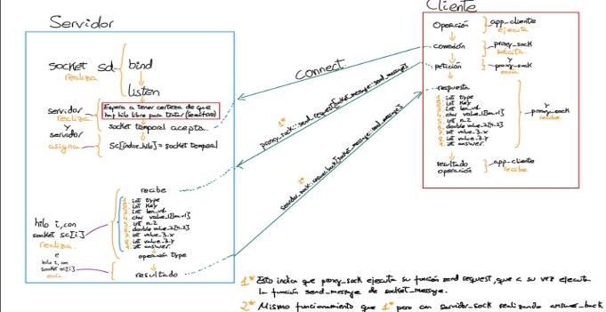

Curso Sistemas Distribuidos 2024-25 Ejercicio 2

**Grado Ing Informática**

Fecha: **06/04/2025** - ENTREGA: **II** GRUPO: **80**

Alumnos:

**Hector  Álvarez Marcos** ''100495794''

**Angela Elena Serrano Casas** ''100475053''

## Índice

- [Introducción](#_page2_x72.00_y72.00)
- [Diseño e implementación](#_page2_x72.00_y410.37)
    - [Decisiones principales](#_page2_x72.00_y443.27)
      - [Serialización de Variables de Tipo Double](#_page2_x72.00_y484.10)
        - [swap_endian()](#_page3_x72.00_y72.00)
        - [isBigEndian()](#_page3_x72.00_y179.15)
  - [Comunicación por sockets](#_page3_x72.00_y314.84)
  - [Diagrama de comunicación](#_page3_x72.00_y489.59)
  - [Servidor](#_page4_x72.00_y72.00)
      - [Apunte necesario sobre la concurrencia](#_page4_x72.00_y330.58)
  - [Cliente](#_page4_x72.00_y513.23)
- [Compilación](#_page5_x72.00_y86.55)
- [Pruebas](#_page5_x72.00_y163.08)
    - [Guernika](#_page5_x72.00_y195.98)
    - [Clientes Generados](#_page5_x72.00_y425.92)
    - [Pruebas de estrés](#_page5_x72.00_y629.76)
        - [test_easy_stress.sh](#_page6_x72.00_y72.00)
        - [test_hard_stress.sh](#_page6_x72.00_y151.38)
        - [test_pesao.sh](#_page6_x72.00_y392.21)
- [Conclusión](#_page6_x72.00_y487.59)
# **Introducción**
En esta práctica, se ha implementado una nueva arquitectura de comunicación entre cliente y servidor, utilizando sockets TCP en lugar del sistema basado en colas de mensajes POSIX que se empleó en el ejercicio anterior. Este cambio de tecnología se ha realizado con el objetivo de mejorar la flexibilidad, escalabilidad y eficiencia del sistema, permitiendo una comunicación más robusta y adaptable a diferentes entornos. En este contexto, la práctica ha incluido la serialización y deserialización de mensajes, asegurando que los datos enviados entre el cliente y el servidor se interpreten correctamente, independientemente de la arquitectura de la máquina o del lenguaje de programación utilizado.

La transición ejecutada entre colas de mensajes POSIX a sockets TCP ofrece una serie de ventajas notables que se enumeran a continuación:

1. Mayor flexibilidad: Los sockets permiten una mayor flexibilidad en cuanto a la estructura de los mensajes y el protocolo de comunicación. Esto facilita la integración de otros sistemas que utilicen diferentes lenguajes o plataformas.
1. Mejor rendimiento: En sistemas con alta concurrencia, la comunicación basada en sockets TCP permite un control más directo sobre las conexiones, reduciendo la latencia y el overhead que puede generarse con las colas de mensajes.
1. Escalabilidad: La arquitectura basada en sockets TCP permite gestionar un número mayor de conexiones simultáneas, lo que mejora la escalabilidad en comparación con el sistema de colas de mensajes POSIX, que tiene limitaciones inherentes en cuanto a la cantidad de mensajes que puede manejar.
# **Diseño e implementación**
## *Decisiones principales*
### **Serialización de Variables de Tipo Double**
Se han realizado una serie de funciones, ubicadas en el directorio /src/common, que otorgan tanto a servidor como a cliente, una serie de funciones para envio y recepción de mensajes, incluido con el archivo de cabeceras “socket\_message.h”

La serialización y deserialización de los mensajes se realiza de la siguiente manera:

Serialización: Los mensajes se estructuran en un formato binario que incluye un encabezado con la longitud de cada campo, seguido de los datos. Los valores según su tipo se convierten a un formato adecuado para la transmisión.

Deserialización: El servidor recibe los mensajes, invierte el proceso de serialización y extrae los datos.

Dado que los valores de tipo *double* tienen una representación en memoria de 8 bytes, uno de los problemas que surgió al implementar el sistema fue asegurar que el valor fuera enviado correctamente entre arquitecturas de *endianess* distintas. La solución propuesta es la implementación de las siguientes funciones:
#### *swap\_endian():*
Para abordar este desafío, decidimos invertir manualmente el orden de los bytes cuando fuera necesario, creando la función *swap\_endian*, la cual  garantiza que el valor de tipo double se transmita en el orden correcto, independientemente de la arquitectura de la máquina. La función *swap\_endian*() toma un valor de tipo *double* y lo convierte a un arreglo de 8 bytes. Luego invierte el orden de los bytes para asegurarse de que se transfiera correctamente entre sistemas con diferentes endianness. El valor resultante se vuelve a convertir a tipo *double*, pero con los bytes reordenados.
#### *isBigEndian():*
Por otro lado, hemos desarrollado una segunda función para comprobar la arquitectura de la máquina local . Esta función verifica el valor de un entero, y dependiendo de la dirección de memoria, determina el tipo de orden de bytes utilizado en la máquina.

El uso en conjunto de ambas funciones se encarga de la resolución del problema mencionado anteriormente

El envio y la recepción de mensajes se trata en las funciones send y receive message, que a su vez para cada parámetro enviado/recibido, usan la funcion send/receive package.
## *Comunicación por sockets*
La comunicación entre el cliente y el servidor se implementa mediante sockets TCP. El servidor crea un socket y escucha en un puerto determinado, esperando recibir conexiones de los clientes. Cada vez que un cliente se conecta, el servidor acepta la conexión, crea un hilo para gestionar la solicitud y responde con el resultado correspondiente.

El cliente, por su parte, se conecta al servidor utilizando las variables de entorno IP\_TUPLAS y PORT\_TUPLAS, que definen la dirección IP y el puerto del servidor. Una vez conectado, el cliente envía una solicitud al servidor a través de un socket, donde la solicitud es serializada en un formato binario para asegurar que los datos sean transmitidos correctamente.
## *Diagrama de comunicación*

## *Servidor*
El servidor se encarga de gestionar las solicitudes de los clientes, utilizando sockets TCP para la recepción y envío de mensajes. Hemos seguido con la idea de crear una “pool” de hilos. Esta vez, para gestionar el tema de sockets, ya que son sockets TCP, cuando se “acepta” una conexión al socket del servidor, conceptualmente, esta conexión se vincula a otro socket, que es el que se encargará de transmitir todos los mensajes. Para integrarlo nosotros con nuestra metodología “pool”, nos hemos generado un array de sockets sc de la misma forma que tenemos un array de hilos, y cuando un socket temporal sc\_temp “acepta” la conexión, se asigna ese descriptor de fichero al índice del hilo sobre el que se va a trabajar, garantizando así, que cada hilo trabaje con su socket, y lo que es mejor, en esta práctica, la región crítica necesaria realizada por cada hilo se reduce exclusivamente al índice del array sobre el que ese hilo trabaja, porque cada hilo accederá siempre a posiciones distintas del array de sockets, por lo que nunca se producirán condiciones de carrera que pongan en riesgo la integridad del sistema. De esta forma, toda la información del mensaje la tratará serializada el propio hilo, sin necesidad de realizar copia local, reduciendo el coste computacional de la región crítica a la copia de un int.

El servidor debe serializar los mensajes entrantes, procesarlos según el tipo de operación ( set, get, modify, …) y luego serializar la respuesta antes de enviarla al cliente.
### **Apunte necesario sobre la concurrencia**
De la primera entrega evaluable, se detectó un problema de concurrencia con la pool de hilos, ya que si se intentaban ejecutar muchos clientes(de la orden de más de 50) se producía un congelamiento de la prueba de estrés por parte del cliente, ya que no gestionaba bien el servidor tantas peticiones simultáneas, pero se enmascaró el problema con la limitación de máximo número de mensajes definido por el sistema de colas de mensajes POSIX. Para este ejercicio, como ya no se tenía esa limitación se ha tenido que reformular la gestión de la concurrencia. Se ha añadido un sistema de gestión de semáforos que permite esperar a que haya algún hilo disponible *antes* de que se pueda llegar a aceptar una conexión, de esta forma, se garantiza que no se acepte ninguna petición de conexión sin la certeza de que se pueda tratar, garantizando la respuesta de todos los mensajes recibidos.
## *Cliente*
El cliente ahora utiliza sockets TCP para establecer una conexión con el servidor. En lugar de depender de colas de mensajes, el cliente envía los datos a través de un socket TCP, que es más flexible y eficiente. Para ello, el cliente establece una conexión con el servidor, serializa los mensajes de acuerdo con el protocolo definido, y luego los envía a través del socket. El cliente recibe la respuesta del servidor, la deserializa y presenta los resultados al usuario.

El proceso de serialización de los mensajes en el cliente es clave para garantizar que la información se envíe en un formato que pueda ser interpretado correctamente por el servidor. Los mensajes se estructuran para incluir un identificador de operación, la clave y el resto de valores, y se envían como una secuencia binaria.

Las principales funciones implementadas en el cliente son las siguientes:

1. *connect\_socket\_to\_server()*: Establece la conexión con el servidor utilizando el socket TCP, configurando la dirección IP y el puerto a partir de las variables de entorno.
1. *send\_request()*: Envía una solicitud al servidor, serializando el mensaje antes de enviarlo.
3. *get\_response()*: Recibe la respuesta del servidor y la deserializa para devolverla al cliente.
# **Compilación**
La compilación de este ejercicio se ha realizado de la misma forma que el anterior, la única diferencia es que se ha añadido la compilación de un cliente “pesao” explicado en la fase de Pruebas
# **Pruebas**
## *Guernika*
Tal y como se comentó en la documentación del primer ejercicio evaluable, se ha tenido que usar el directorio /tmp para alojar la base de datos, puesto que por distintas operaciones propias de ella, no ubicarla en este directorio daba lugar a conflictos derivados en el bloqueo y malfuncionamiento de esta. No obstante, para no tener los problemas que existieron a la hora de realizar la calificación del ejercicio, se ha añadido al nombre del fichero el usuario conectado al guernica. Por ejemplo en nuestro caso se generará el archivo con ruta “/tmp/database\_a0495794.db”.

En el primer ejercicio evaluable, con el objetivo de evaluar el correcto funcionamiento del sistema en diferentes condiciones se realizaron una serie de pruebas para profundizar y examinar los límites de nuestra implementación. Para la comprobación de estos mismo límites en la nueva implementación propuesta, se ha decidido mantener el uso de estas pruebas las cuales se encuentran distribuidas en varios archivos, cada uno con un propósito específico. Se ha añadido también una prueba adicional para verificar la correcta respuesta del servidor ante prueba de estrés combinando la lógica de todas nuestras pruebas, explicadas en el apartado test\_pesao.sh
## *Clientes Generados*
Hemos generado 3 clientes distintos, pero con una estructura prácticamente idéntica. Realiza 2 set\_value, un get\_value, un modify\_value, un delete\_key y un destroy, todo en ese orden. Generamos 3 clientes similares para luego poder realizar pruebas de estrés con más facilidad.

A parte de esto, hemos creado una implementación de un “cliente infinito”, que va pidiendo por terminal que operación se desea realizar y los campos necesarios para dicha operación todo repitiendo en bucle mientras se desee.

También, adicionalmente, para la prueba “pesao”, se ha generado un cliente que realiza únicamente peticiones de inserción, garantizando, que, cuando se realize un test de estres realizando la llamada de este ejecutable múltiples veces, se genere respuesta positiva del servidor en todas ellas. En las otras pruebas, solo se medía que toda petición de los clientes recibiera respuesta, pero no que esta, además, fuera satisfactoria.
## *Pruebas de estrés*
Hemos querido realizar pruebas de estrés para evaluar el comportamiento de nuestro sistema, implementando un archivo bash que ejecuta de forma simultánea distintos clientes, con el objetivo de analizar y llevar al límite a nuestro servidor.

Hemos dividido las pruebas de estrés en 3 partes:
### **test\_easy\_stress.sh**
Implementa una prueba de estrés automatizada que simula un bajo volumen de operaciones simultáneas, incluyendo inserciones, modificaciones y eliminaciones de claves. Se analizaron métricas de rendimiento y la capacidad del sistema para manejar grandes volúmenes de solicitudes sin degradación significativa.
### **test\_hard\_stress.sh**
Implementa una prueba de estrés automatizada que simula un gran volumen de operaciones simultáneas, incluyendo inserciones, modificaciones y eliminaciones de claves. De nuevo, se analizaron métricas de rendimiento y la capacidad del sistema para manejar grandes volúmenes de solicitudes sin degradación significativa. Esta prueba se realiza con el único proposito de probar que el servidor no realiza goteo de información por el gran volumen de mensajes que llega a recibir, denotando como factor limitante al propio sistema operativo

Durante las pruebas de carga, se observó una limitación del sistema al intentar manejar más de 50 clientes simultáneamente(Esta prueba depende del sistema en el que se realice, en algunos sistemas soportaba hasta 50 clientes, en otros a los 18/20 paraba). Aunque las operaciones básicas de inserción, recuperación y modificación se realizaron correctamente bajo carga moderada, cuando se superó este umbral, se presentó un problema en el que la cola de mensajes alcanzaba su capacidad máxima, lo que impedía la recepción de nuevas solicitudes y generaba un mensaje de error indicando que la cola estaba llena.

**test\_pesao.sh**

Implementa una prueba de estrés que verifica que se realicen múltiples peticiones de inserción de manera paralela. Combina tanto gestión de estres como garantizar que la respuesta de la base de datos sea la esperada, porque en las otras pruebas daba igual la respuesta, mientras que aquí importa que todas se realicen correctamente.
# **Conclusión**
La implementación del sistema cliente-servidor mediante sockets TCP en lugar de colas de mensajes POSIX ha proporcionado una visión más clara de los beneficios y retos que conlleva el uso de diferentes tecnologías de comunicación en sistemas distribuidos. El uso de sockets ha permitido una mayor flexibilidad y escalabilidad en la gestión de la comunicación, facilitando la creación de un sistema más eficiente y adaptable a diferentes entornos. Además, la implementación de la serialización de datos, especialmente en el caso de los valores de tipo double, ha reforzado nuestra comprensión sobre cómo manejar la comunicación de datos complejos de manera robusta y sin pérdidas de precisión, independientemente de la arquitectura del sistema.

Esta práctica ha sido esencial para el desarrollo de nuestra formación en la asignatura. Nos ha permitido aplicar conceptos de arquitectura de sistemas distribuidos de manera práctica, gestionando la concurrencia, optimizando la comunicación y, lo más importante, enfrentándonos a los desafíos de implementar soluciones robustas en un entorno real. A través de esta práctica, no solo hemos consolidado nuestra comprensión teórica sobre los sockets, sino que hemos adquirido una experiencia valiosa en el diseño, implementación y evaluación de sistemas que permiten la interacción eficiente entre múltiples procesos. En resumen, esta práctica ha sido un paso significativo en nuestra formación, permitiéndonos experimentar de primera mano las dificultades y soluciones que surgen al construir sistemas distribuidos eficientes y escalables.
8 
